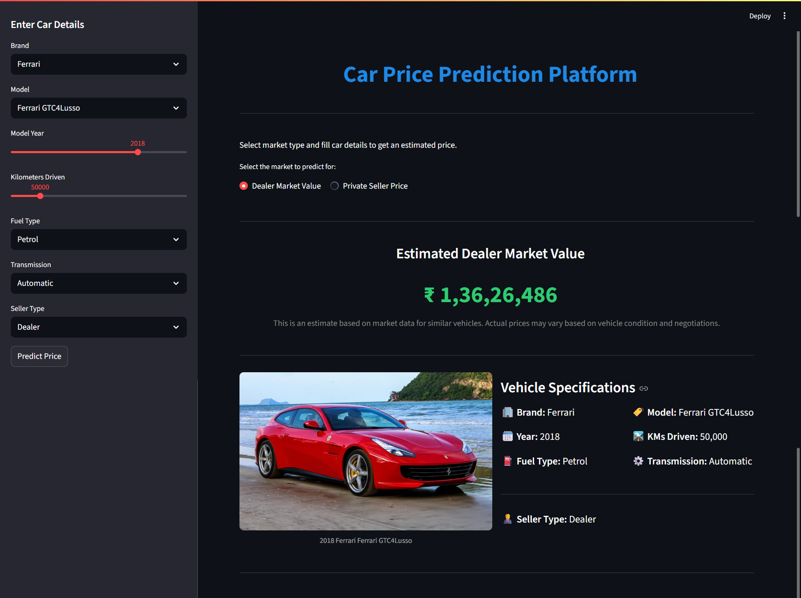

# **Car Price Prediction Platform**

  

This project is a comprehensive car price prediction platform that provides users with estimated valuations for their vehicles in the Indian used car market. The application leverages a unique two-model approach to deliver more accurate and context-aware predictions, distinguishing between the **dealer market** and the **private seller market**.

The entire application is built with a user-friendly interface using Streamlit.

## **Features:**

* **Dual Model Prediction:** Users can choose to get a price estimate for two distinct scenarios:  
  * **Dealer Market Value:** Predicts the price a user might get from a professional dealership.  
  * **Private Seller Price:** Predicts the price a user could set when selling their car directly to another individual.  
* **Dynamic UI:** The user interface intelligently adapts based on the selected market type, showing only relevant input fields.  
* **Cascading Dropdowns:** Selecting a car brand dynamically filters the model dropdown to show only relevant models for a seamless user experience.  
* **High-Performance Modeling:** The models were built using the powerful and accurate **XGBoost** library.  
* **Professional Valuation Report:** The final prediction is displayed in a clean, professional card layout, complete with vehicle specifications and an Indian currency format.

## **Project Workflow:**

The project followed a structured data science workflow:

1. **Data Exploration:** Initial analysis began with a review of multiple datasets from various platforms, including Cars24 and Quikr.  
2. **Strategic Data Selection:** During exploration, it was discovered that the cardekho\_dataset.csv was a single, rich, high-quality source that contained a seller\_type column. This was a key finding, as it allowed for a clean and accurate separation of dealer vs. private-seller data without the need to combine multiple, messier files.  
3. **Data Cleaning & Preprocessing:**  
   * The master Cardekho dataset was loaded and underwent a thorough cleaning process (standardizing column names, correcting data types, calculating vehicle age, and imputing missing values with the median).  
   * The cleaned data was then strategically split into two distinct, model-ready CSV files: dealer\_market\_data.csv and private\_market\_data.csv.  
4. **Model Training:**  
   * Two separate **XGBoost Regressor** models were trained—one for each market type.  
   * While initial training was performed on a GPU, the models were ultimately **retrained on the CPU**. This was a crucial step to resolve deployment compatibility issues with Streamlit, ensuring the final application is stable and runs smoothly.  
5. **Model Evaluation:**  
   * The **Dealer Model** achieved an R-squared of **0.935**, indicating high accuracy in a structured market.  
   * The **Private Seller Model** achieved an R-squared of **0.846**, a strong result for the more volatile private market.  
6. **Web Application Development:** A user-friendly front-end was built using Streamlit, incorporating all the features mentioned above.

## **File Structure:**

Car\_price/  
├── app.py  
├── models/  
│   ├── cardekho\_dealer\_model.joblib  
│   └── private\_seller\_model.joblib  
├── notebooks/  
│   ├── Dealer\_Model.ipynb  
│   ├── Private\_Model.ipynb  
│   └── Seperate\_Datasets.ipynb  
├── data/  
│   ├── cardekho\_dataset.csv  
│   ├── dealer\_market\_data.csv  
│   └── private\_market\_data.csv  
├── requirements.txt  
└── README.md

## **How to Run This Project:**

To set up and run this project on your local machine, follow these steps:

**1\. Clone the Repository:**

git clone \[https://github.com/your-username/car-price-prediction.git\](https://github.com/your-username/car-price-prediction.git)  
cd car-price-prediction

**2\. Create a Virtual Environment (Recommended):**

python \-m venv venv  
source venv\\Scripts\\activate

**3\. Install the Required Libraries:**

pip install \-r requirements.txt

**4\. Run the Streamlit Application:**

streamlit run app.py

Your web browser should automatically open to the application's local URL.

## **Future Improvements:**

* **Dynamic Car Images:** Integrate a robust image search API (like Google Custom Search or Bing Image Search) to fetch and display real images of the cars instead of placeholders.  
* **Hyperparameter Tuning:** Use techniques like Grid Search or Randomized Search to find the optimal parameters for the XGBoost models, potentially increasing accuracy.  
* **Deployment:** Deploy the Streamlit application to a cloud service like Streamlit Community Cloud or Heroku to make it publicly accessible.

## **Data Source:**

The core dataset used for this project was the **"CarDekho Used Car Dataset"** available on Kaggle.

-   **Source:** [CarDekho Used Car Dataset on Kaggle](https://www.kaggle.com/datasets/manishkr1754/cardekho-used-car-data)
-   **Credit:** The dataset was provided by Kaggle user Manish Kumar.
